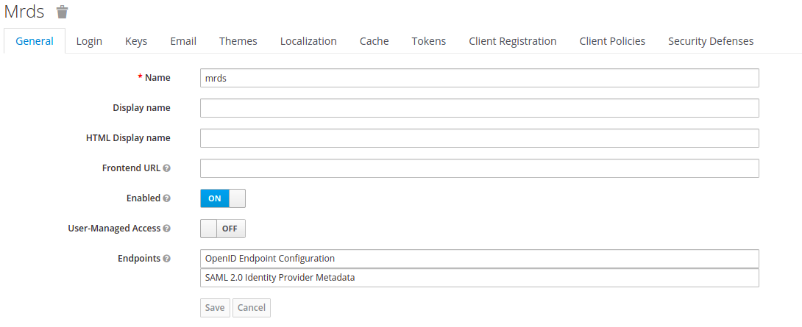
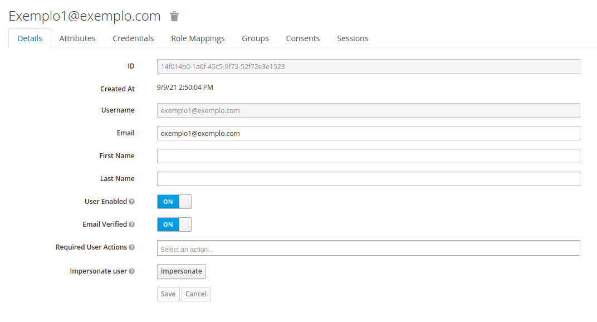
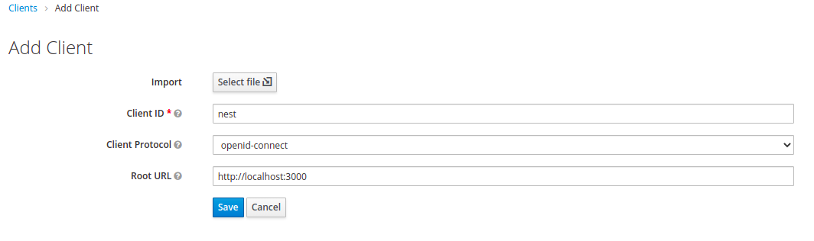

# NestJS + Keycloak

Nesse exemplo vamos utilizar essa ferramenta **Keycloak** para gerenciar
todas as permissões e autenticações.

## Requisito

- Docker e Docker Compose
- NodeJS
- NestJS
- Keycloak

## Inicializar

```bash
docker-compose up
```

## Procedimento

Open `http://localhost:8080/auth` no seu navegador.
  
Para obter mais detalhes, consulte a [documentação do Keycloak](https://www.keycloak.org/documentation.html).

1) Criar um novo **REALME** de nome **MRDS**
    
2) Criar um usuário exemplo1@exemplo.com
    
3) Adicionar um Client: **nest**
    
  
    Selecionar *Access Type* : confidential
